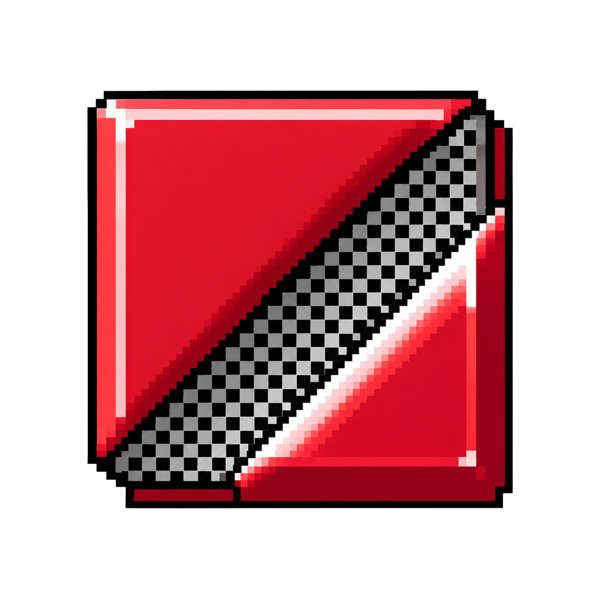

<div align="center">



# SCRIPTA
### *The Local-First Cognitive Spatial Writing Space*

[](https://opensource.org/licenses/MIT)
[](#progressive-web-app--offline-capabilities)
[](https://reactjs.org/)
[](https://vitejs.dev/)
[](https://www.paypal.com/paypalme/eldrexbula)

*A specialized writing environment that separates idea generation, structural organization, and language refinement across cognitive spatial rooms.*

---

</div>

## 🌌 The Core Philosophy

Most modern word processors force writers into an impossible multitasking trap: **generating thoughts** and **self-criticizing/editing** at the exact same moment on the exact same blank document.

**Scripta** solves this by physically separating the act of writing into **three distinct spatial rooms**, where each room enforces the cognitive constraints necessary for that specific phase of thinking.

```
┌─────────────────┐       ┌─────────────────┐       ┌─────────────────┐       ┌─────────────────┐
│  THE THRESHOLD  │  ──►  │   THE SANDBOX   │  ──►  │ THE CUTTING ROOM│  ──►  │   THE SCULPTOR  │
│  State Inquiry  │       │ Pure Generation │       │Card Organization│       │Language Polish &│
│  & Living Sky   │       │ (No Backspace)  │       │  & Block Labels │       │  Multi-Exports  │
└─────────────────┘       └─────────────────┘       └─────────────────┘       └─────────────────┘
```

---

## 🏛️ The Spatial Rooms

### 1. Step 1: The Threshold
- **Single Question Focus**: State your core premise or inquiry before typing (*"What are you trying to think about?"*).
- **Living Sky & Nature Canvas**: Procedural, time-adaptive sky background (*Dawn, Day, Sunset, Midnight Starfield*) with gentle wind-swaying grass blades and customizable weather (*Gentle Rain, Cozy Thunderstorm, Winter Snowfall*).

### 2. Step 2: The Sandbox
- **Pure Generative Flow State**: Backspace, Delete, and arrow navigation are locked by default to prevent premature self-criticism.
- **3-Tier Visual Line Fading**: Older paragraphs gently recede (100% $\rightarrow$ 42% $\rightarrow$ 16% opacity) to keep you writing forward.
- **Blinking Typewriter Caret & Auto-Centering**: Keeps your active typing line locked in the ergonomic sweet spot of your screen.
- **Inactivity Pulse**: Subtle atmospheric dimming after 30 seconds of stillness, ringing a resonant singing bowl chime after 60s.

### 3. Step 3: The Cutting Room
- **Thought Blocks as Moveable Index Cards**: Your raw text is automatically chunked into independent draggable cards.
- **Structural Labeling Constraint**: Categorize each card (`Introduction`, `Evidence`, `Counterargument`, `Conclusion`, `Unclear`) with colored tag themes and a real-time progress bar.
- **Split & Merge Controls**: Divide long blocks or fuse related thoughts together before polishing.

### 4. Step 4: The Sculptor
- **Full Manuscript Editing Restored**: Reassembled into a continuous reading canvas with margin subheadings.
- **Robotic Voice Read-Aloud**: Audio speech synthesizer tracks sentence cadence with an active sentence spotlight and adjustable speed ($0.8\times, 1.0\times, 1.2\times$).
- **Hemingway Analyzer**: Interactive color-coded highlighting for long sentences, adverbs, and complex academic vocabulary with hover suggestions.
- **1-Click Clipboard Copy**: Instant manuscript copy with animated toast notifications.

---

## ✨ Key Features

- 📱 **Progressive Web App (PWA) & 100% Offline**: Full `manifest.json` and Service Worker pre-caching for standalone mobile and desktop installation with zero network dependencies.
- 📄 **Multi-Format Export Suite**:
  - **Microsoft Word (`.docx` / `.doc`)**: Formatted with publication date, inquiry heading, and clean margins.
  - **PDF Document (`.pdf`)**: Custom `@media print` typography with 1-inch margins and high-contrast serif formatting.
  - **Markdown (`.md`)**, **Plain Text (`.txt`)**, **HTML (`.html`)**, and **Scripta Project (`.scripta`)**.
- 📊 **Document Provenance & Writing Receipt**: Real-time tracking of active writing duration, session days, structural revisions, and deletion counts, with an optional Colophon footer attached to exports.
- 🎹 **4 Tactile Mechanical Audio Profiles**: Real-time procedural Web Audio synthesis featuring:
  - 🏛️ *Vintage Typewriter* (heavy striker impact & carriage return)
  - 🧈 *Creamy Lubed Linear* (deep bubble thock / Holy Panda)
  - ⚡ *Clicky Blue Switch* (sharp tactile snap)
  - 🤫 *Quiet Membrane Tap* (dampened cushioned tap)
- 🎚️ **Preferences & Accessibility**:
  - Live **Typography Scaling Slider** ($14\text{px}\text{--}26\text{px}$).
  - iOS/Mac-style **tactile animated pill toggle switches**.
  - **Dyslexia-friendly font** and **High Contrast mode**.
  - Gesture-friendly **Mobile Bottom-Sheets** with drag handles.

---

## ⌨️ Global Keyboard Shortcuts

| Shortcut | Action |
| :--- | :--- |
| <kbd>Alt</kbd> + <kbd>1</kbd> | Navigate to **The Sandbox** |
| <kbd>Alt</kbd> + <kbd>2</kbd> | Navigate to **The Cutting Room** |
| <kbd>Alt</kbd> + <kbd>3</kbd> | Navigate to **The Sculptor** |
| <kbd>Ctrl</kbd> + <kbd>E</kbd> | Complete drafting and organize thoughts |
| <kbd>Ctrl</kbd> + <kbd>S</kbd> | **The Save Ritual** (Project file + Future Note) |
| <kbd>Ctrl</kbd> + <kbd>O</kbd> | Open and resume `.scripta` project file |
| <kbd>Ctrl</kbd> + <kbd>R</kbd> | Toggle Robotic Voice Read-Aloud |
| <kbd>Ctrl</kbd> + <kbd>H</kbd> | Toggle Hemingway Mode analyzer |
| <kbd>Alt</kbd> + <kbd>M</kbd> | Toggle Audio Mute / Unmute |
| <kbd>?</kbd> | Open Shortcuts Reference guide |
| <kbd>F11</kbd> | Toggle Distraction-Free Fullscreen |

---

## 🚀 Getting Started

### Prerequisites
- Node.js 18.0 or higher
- npm 9.0 or higher

### Installation

```bash
# Clone repository using GitHub CLI
gh repo clone EldrexDelosReyesBula/scripta

# Or clone using git
git clone https://github.com/EldrexDelosReyesBula/scripta.git

# Navigate into project
cd scripta

# Install dependencies
npm install

# Start development server
npm run dev
```

Open your browser at `http://localhost:5173`.

### Production Build

```bash
# Build optimized production bundle
npm run build

# Preview production build locally
npm run preview
```

---

## 🛠️ Technology Stack

- **Framework**: React 18
- **Build Tool**: Vite 6
- **Animations & Gestures**: Framer Motion
- **Icons**: Personalized Scripta Vector Icons + Lucide React
- **Audio Engine**: Zero-latency Web Audio API procedural synthesis
- **Typography**: Native Marginalia Package (`Marginalia Mono`, `Marginalia Serif`)
- **Offline & Storage**: Progressive Web App (Service Worker + Manifest) & File System Access API

---

## 👨‍💻 Creator & Author

**Eldrex Delos Reyes Bula**
- 📧 **Email**: [eldrexdelosreyesbula@gmail.com](mailto:eldrexdelosreyesbula@gmail.com)
- 💖 **Support / Sponsor**: [PayPal Donation](https://www.paypal.com/paypalme/eldrexbula)

If you love Scripta or use it for your daily writing and thinking, consider supporting its continuous development through PayPal!

---

## 📄 License

This project is open source and available under the [MIT License](LICENSE).
